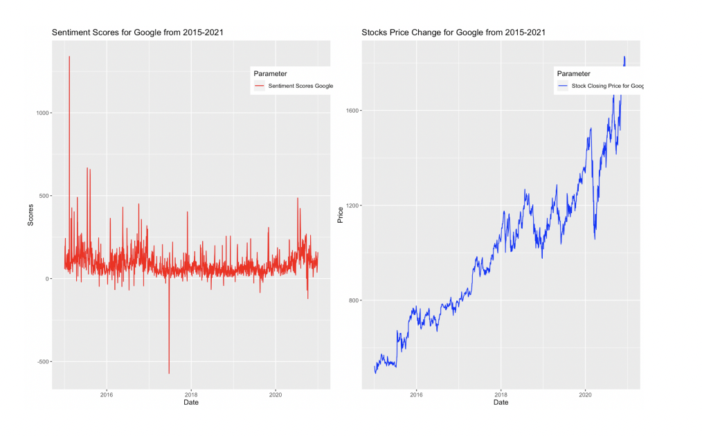

Sentimental and time series analys of Google, Microsoft and Apple from 2015 - 2021

This project analyzes the complex relationship between Twitter data and the financial market instruments (like stock prices and volume). We have investigated Twitter sentiments for about 5 million tweets between January 2015 and January 2021 for Apple, Microsoft, and Google stocks. We studied the relationship in the time frame 2015 to 2021. Our results show a high correlation (up to 0.55) between stock prices and Twitter sentiments in the time frame. The data scraped from Twitter is evaluated using the get_sentiment toolkit of the "Syuzhet" package. Furthermore, with regression analysis, we concluded that the percentage of the variance in the stock indices is explained to a certain extent by the public sentiments for a short interval.

Here are some graphs from the companies sentimental scores and stock closing prices:

Our approach shows good correlation values between the features 0.553 for stock prices of the three companies and their sentimental scores and here are the results:

